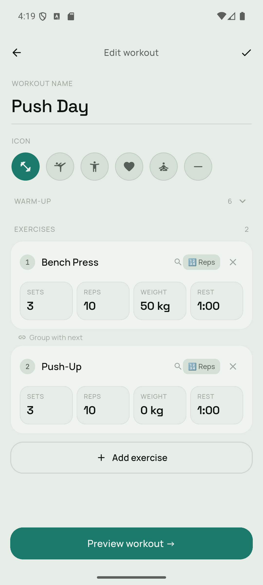
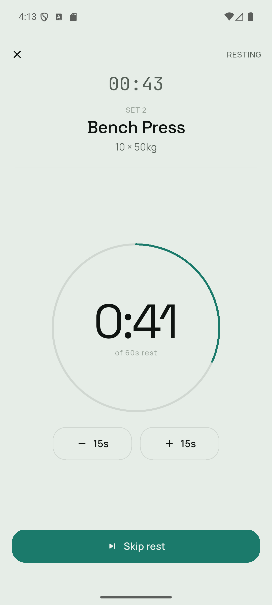
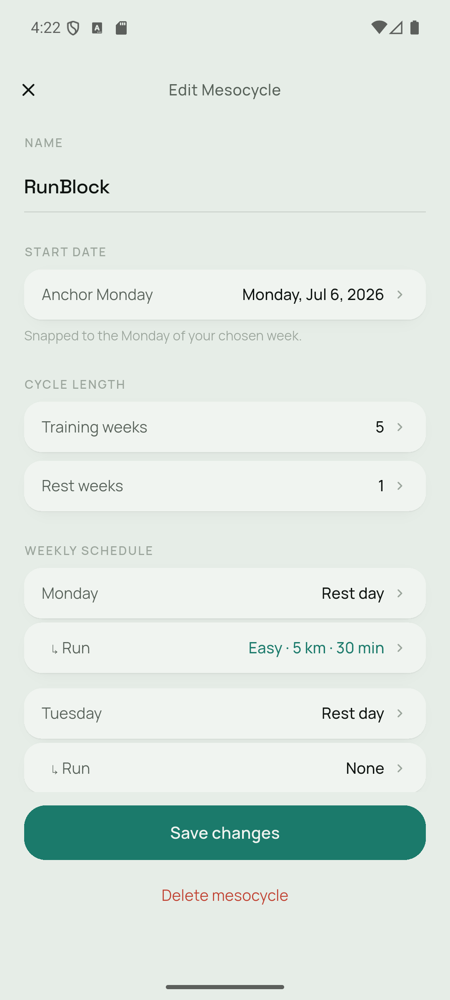
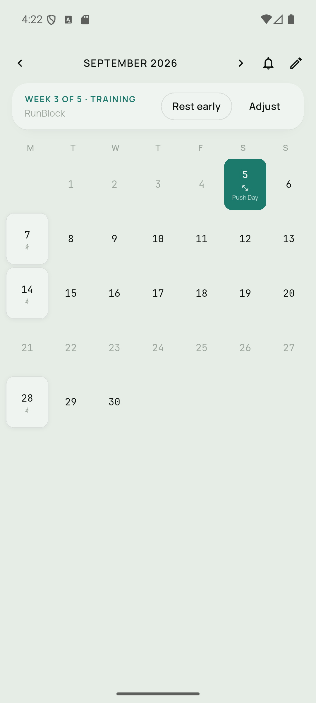
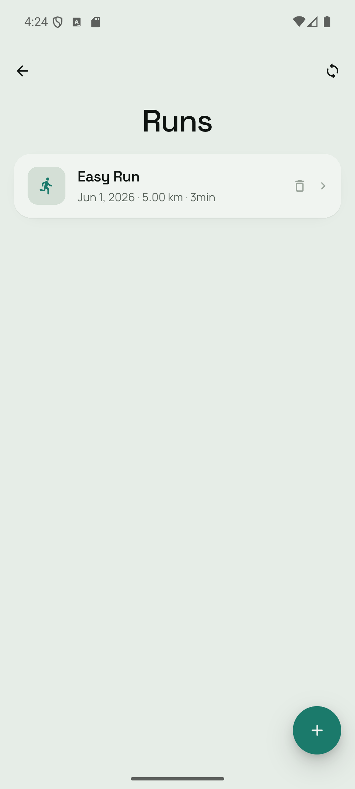
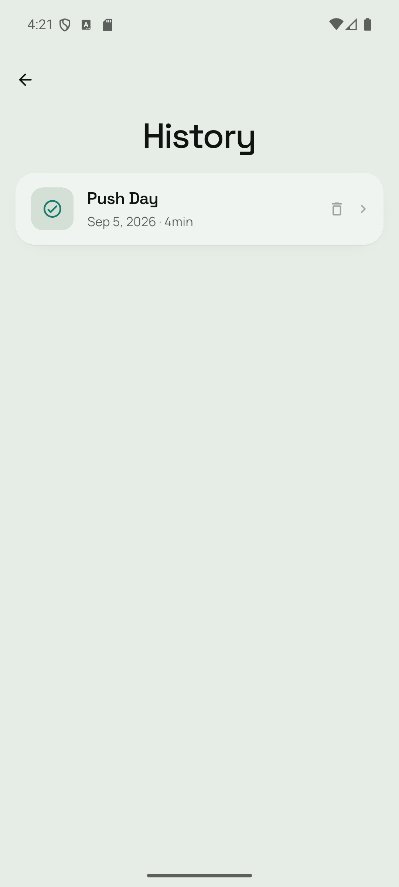

# PlateUp

A Flutter workout tracking app for Android that keeps everything local.

## What it does

**PlateUp** lets you build your own workout programs and follow them at the gym. You design the workouts once, then the app handles the structure while you lift.

## Tech stack

- **Flutter** (Dart) — Note: the owner only verified on Android as he uses an android phone. IOS users, use at your own risk. 
- **Riverpod** — state management
- **Hive** — on-device storage (workouts, sessions, mesocycles, overrides)
- **flutter_local_notifications** — workout reminder notifications

## Building

Requires Flutter SDK `^3.11.0`.

```bash
flutter pub get
flutter run
```

To build a release APK:

```bash
flutter build apk --release
```

## Core features

**Workout builder** — Create workouts with any combination of exercises. Configure sets, reps, weight, and rest time per exercise. Supports supersets (two exercises back-to-back) and timed exercises (e.g. planks). Optional warm-up sequences can be added to any workout.



**Live session screen** — Guides you through your workout set by set. Tracks rest timers between sets, keeps the screen on during sessions, and plays an audio cue when rest ends. Logs the weight and reps you actually completed.



**Mesocycles** — Organise your training into structured training blocks. A mesocycle assigns specific workouts to days of the week and runs for a configurable number of training weeks followed by a deload/rest week. The app tracks which week of the cycle you're in and repeats the cycle automatically.



**Calendar view** — See your scheduled workouts on a monthly calendar, with reminder notifications for upcoming workout days. Tap any day to start that day's assigned workout directly. Supports day-level overrides (swap or skip a specific day without changing the whole plan).



**Running** — Log runs manually or import them from Health Connect (e.g. a Samsung watch) — distance, duration, pace, HR, cadence. Runs can be scheduled alongside strength days in a mesocycle and show up on the calendar.



**Session history** — Every completed session is saved locally. Browse past sessions, see which workouts you did, and review the sets and weights logged.



## Data & privacy

All data is stored on-device using Hive. Nothing is sent to any server. Uninstalling the app removes all data.
